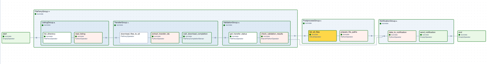

# Propósito del DAG
Este DAG implementa un flujo de transferencia de archivos desde **un servidor SFTP hacia Amazon S3** utilizando los operadores FileFerry, automatizando la descarga segura de archivos desde SFTP hacia S3.

---
# Funcionamiento
El DAG sigue este flujo:

## 1. FileFerryGroup - Transferencia Principal

- **ListingGroup**: Lista archivos disponibles en el directorio SFTP y lee el contenido del listado

- **TransferGroup**: Descarga archivos del SFTP hacia S3 y monitorea el progreso

- **ValidationGroup**: Valida el estado de las transferencias y decide el flujo siguiente

## 2. PostprocessGroup - Post-procesamiento

- Lista archivos descargados en S3 para verificación

- Prepara las rutas de archivos para notificación

## 3. NotificationGroup - Notificación

- Recopila datos del resultado de las transferencias

- Envía notificaciones sobre el estado final

---
# Características Clave

- **Descubrimiento automático**: Lista dinámicamente archivos disponibles en SFTP

- **Validación de transferencias**: Verifica el estado de cada descarga

- **Manejo de errores**: Integración con Opsgenie para alertas

- **Verificación post-transferencia**: Confirma archivos descargados en S3

- **Flujo condicional**: Dirige el flujo según el resultado de las validaciones

---
# Diseño del DAG

