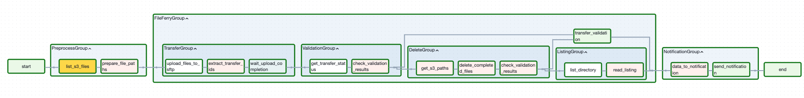

# Propósito del DAG
Este DAG implementa un flujo de transferencia de archivos desde Amazon S3 hacia un servidor SFTP utilizando los operadores FileFerry. Su propósito principal es automatizar la transferencia segura de archivos entre estos dos sistemas de almacenamiento.

---
# Funcionamiento
El DAG sigue este flujo:

## 1. PreprocessGroup - Preparación
- Lista archivos en S3 desde el bucket configurado

- Prepara las rutas de archivos para la transferencia

## 2. FileFerryGroup - Transferencia Principal

- **TransferGroup:** Sube archivos de S3 al SFTP y monitorea el progreso

- **ValidationGroup:** Valida el estado de las transferencias

- **DeleteGroup:** Elimina archivos completados exitosamente de S3

- **ListingGroup:** Lista el contenido del directorio SFTP de destino

## 3. NotificationGroup - Notificación

- Recopila datos del resultado de las transferencias

- Envía notificaciones sobre el estado final

---
# Características Clave

**Manejo de errores:** Integración con Opsgenie para alertas

**Limpieza automática:** Elimina archivos de S3 después de transferencia exitosa

**Validación:** Verifica el estado de cada transferencia

**Flexibilidad:** Maneja transferencias parcialmente exitosas

**Monitoreo:** Utiliza sensores para esperar la completación de transferencias

---
# Diseño del DAG

