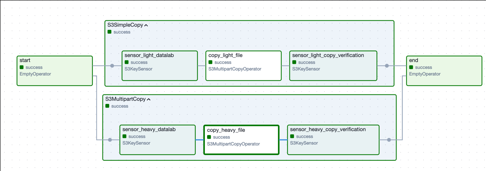

[[_TOC_]]

# Propósito del DAG
Este DAG es un **ejemplo de demostración** del operador `S3MultipartCopyOperator`, mostrando cómo copiar archivos de diferentes tamaños entre buckets S3 de manera eficiente.

---
# Funcionamiento
El DAG ejecuta dos flujos paralelos para demostrar las capacidades del operador:

## 1. S3SimpleCopy - Copia Simple

- **sensor_light_datalab**: Detecta la presencia del archivo pequeño (< 5GB) en S3

- **copy_light_file**: Utiliza `copy_object` para transferir el archivo de manera eficiente

- **sensor_light_copy_verification**: Confirma que el archivo fue copiado correctamente al destino

## 2. S3MultipartCopy - Copia Multipart

- **sensor_heavy_datalab**: Detecta la presencia del archivo grande (> 5GB) en S3

- **copy_heavy_file**: Utiliza multipart copy con partes de 200MB para manejar archivos grandes

- **sensor_heavy_copy_verification**: Confirma que el archivo fue copiado correctamente al destino

---
# Características Clave

- **Copia inteligente**: Selecciona automáticamente el método óptimo según el tamaño del archivo

- **Manejo de archivos grandes**: Utiliza multipart copy para archivos > 5GB con partes configurables

- **Verificación de integridad**: Confirma que los archivos copiados mantienen el mismo tamaño

- **Ejecución paralela**: Los dos grupos se ejecutan simultáneamente __con fines demostrativos__ para mostrar cómo el operador detecta automáticamente el tamaño del archivo y selecciona el método de copia apropiado (copy_object para < 5GB o multipart copy para > 5GB)

- **Sensores deferibles**: Utiliza sensores S3 eficientes con modo reschedule

---

## Diseño del dag

